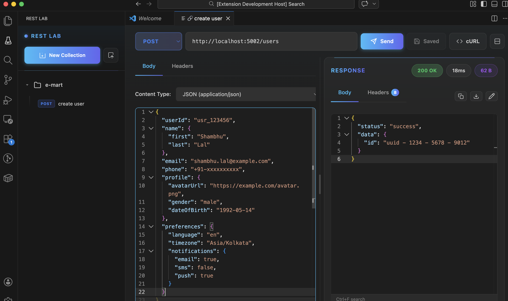
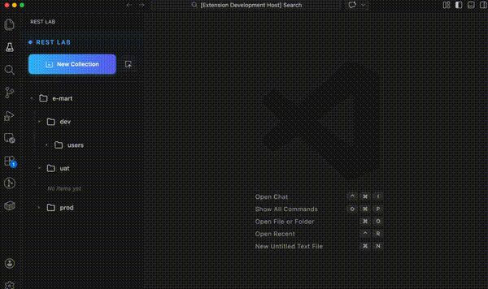
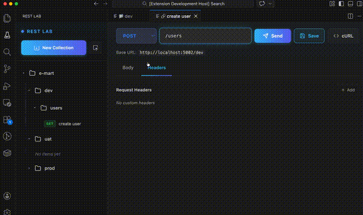
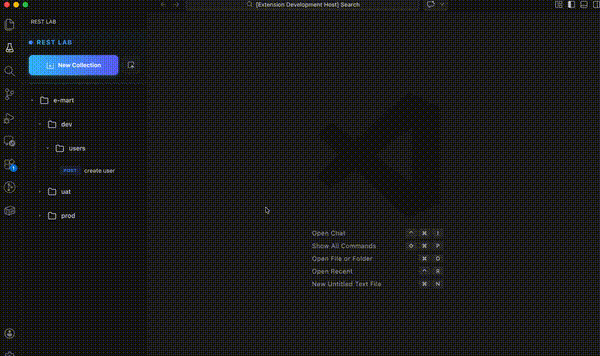
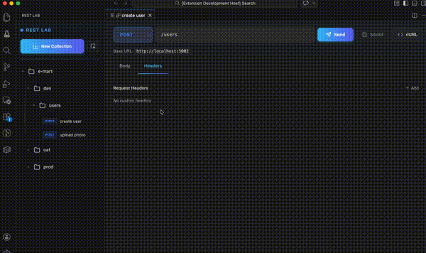
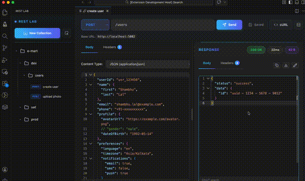
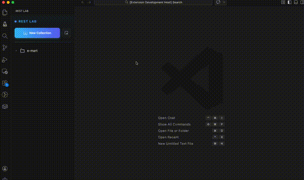
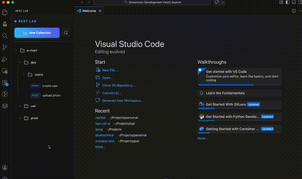

# REST Lab

### A modern REST API client for Visual Studio Code. Test, debug, and manage your APIs with a beautiful, intuitive interface.

---

## ✨ Features

### 🚀 Full HTTP Method Support

Test your APIs with all standard HTTP methods including GET, POST, PUT, PATCH, DELETE, HEAD, and OPTIONS.

<!--  -->

---

### 📁 Organize with Collections & Folders

Create folders to organize your API requests. Keep your workspace clean and structured with unlimited collections.

---

### ⚙️ Folder-Level Configuration

Set base URLs and default headers at the folder level. All requests within a folder automatically inherit these settings, reducing repetitive configuration.

---

### 📝 Modern Request Editor

Clean, intuitive interface for crafting requests with editable names, organized tabs, and easy-to-use editors.

---

### 🎯 Multiple Content Types

Support for all common content types:

- JSON (with syntax highlighting)
- XML
- Form URL Encoded
- Multipart Form Data
- Plain Text
- HTML

<!--  -->

---

### 📤 File Upload Support

Easily upload files using multipart form data with built-in file picker.

---

### 💡 Smart Header Autocomplete

Intelligent autocomplete for common HTTP headers makes request configuration faster and error-free.

---

### 📊 Beautiful Response Viewer

View formatted responses with:

- Syntax-highlighted JSON/XML
- Response headers display
- Status code indicators
- Response time tracking
- Response size metrics

---

### 📥 Export/Import Collections

Export/Import your existing collections from:

- REST Lab native format
- Postman (v2.1 format)
- Thunder Client

Share your API collections with team members or backup your work.

---

### 🔧 Copy as cURL

Generate cURL commands from any request with a single click. Perfect for sharing API calls or debugging in terminal.

<!--  -->

---

### 🎨 Drag & Drop Organization

Reorder your requests and folders with intuitive drag-and-drop functionality.

---

### 💾 Persistent Storage

All your requests, folders, and configurations are automatically saved and persist across VS Code sessions.

<!--  -->

---

### 📋 Response Actions

- Copy response data to clipboard
- Download response as file
- Beautify JSON/XML responses
- View raw response data

<!--  -->

---

## 🚀 Getting Started

### Installation

1. Open VS Code
2. Go to Extensions (Ctrl+Shift+X / Cmd+Shift+X)
3. Search for "REST Lab"
4. Click Install

### Quick Start

1. **Open REST Lab**: Click the REST Lab icon in the Activity Bar (left sidebar)
2. **Create a Folder**: Click the folder icon (📁) to create your first collection
3. **Configure Folder** (Optional): Click the ⚙️ icon to set base URL and default headers
4. **Add Request**: Click the ➕ icon to create a new request
5. **Send Request**: Configure your request and click the Send button!

---

## 💡 Usage Tips

- **Organize by Project**: Create separate folders for different APIs or projects
- **Use Base URLs**: Set base URLs at the folder level to avoid repetition
- **Default Headers**: Configure common headers (like Authorization) at folder level
- **Quick Testing**: Press Send button or use keyboard shortcuts for faster testing
- **Import Existing**: Migrate from Postman or Thunder Client using the import feature

---

## 📋 Requirements

- Visual Studio Code 1.85.0 or later

---

## 🤝 Contributing

Contributions are welcome! Feel free to submit issues and pull requests.

---

## 📄 License

This project is licensed under the MIT License - see the [LICENSE.md](LICENSE.md) file for details.

---

**Enjoy testing your APIs with RESTLab!** 🧪

Made with ❤️ for the VS Code community

